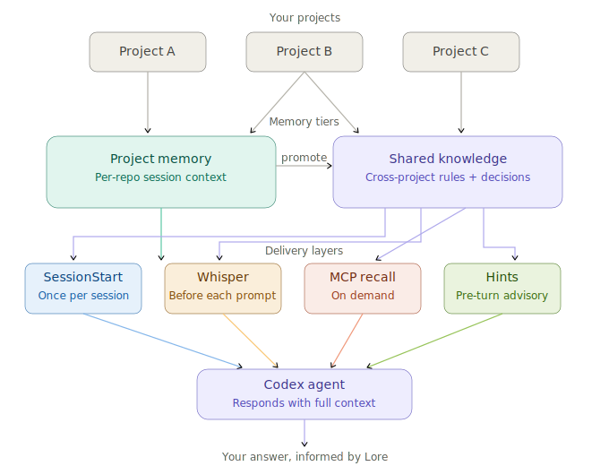

# Lore — Cross-Project Memory for Codex

**A Codex plugin that gives your AI coding agent persistent, shared knowledge across every project and session.**

Lore remembers your domain rules, architecture decisions, coding preferences, and glossary terms — and whispers the right ones at the right time, so you never have to re-explain your codebase again.

---

## Table of Contents

- [Quick Start](#quick-start)
- [What Lore Does](#what-lore-does)
- [How It Works](#how-it-works)
- [Real-World Examples](#real-world-examples)
- [Shared Knowledge Kinds](#shared-knowledge-kinds)
- [You Control Everything](#you-control-everything)
- [MCP Recall Tools](#mcp-recall-tools)
- [CLI Reference](#cli-reference)
- [Installation](#installation)
- [Development](#development)
- [Design](#design)
- [Uninstalling](#uninstalling)
- [Contributing](#contributing)
- [License](#license)

## Quick Start

```bash
git clone https://github.com/yimwoo/lore.git /tmp/lore && bash /tmp/lore/install.sh
```

Then restart Codex, open **Local Plugins**, find **Lore**, and click **Install**.

### Teach Lore Something

```bash
lore promote \
  --kind domain_rule \
  --title "Use snake_case for DB columns" \
  --content "All database columns must use snake_case naming across services and migrations." \
  --tags "naming,database"
```

That's now in your shared knowledge. Every future session, across every project, your agent knows this rule.

### See What Lore Knows

```bash
lore list-shared
```

### Remove Outdated Knowledge

```bash
lore demote <entry-id> --reason "migrated to camelCase"
```

## What Lore Does

Every time you start a new Codex session, your coding agent forgets everything — your naming conventions, your architecture decisions, why you chose library A over B. You end up re-explaining the same context across every project, every session, every day.

Lore fixes this. It's a [Codex](https://openai.com/index/introducing-codex/) plugin that maintains persistent, cross-project memory and delivers it automatically:

```text
You type: "fix the billing migration"

Your agent sees (you don't have to):
  [Lore]
  - rule: DB columns use snake_case across all services.
  - architecture: MySql is the source of truth for billing state.

Your agent responds:
  "Since your project uses snake_case for DB columns, I'll name the
   new field payment_status_code. And I'll write directly to MySql
   rather than going through the Redis cache."
```

No extra prompts. No copy-pasting context. Your agent just *knows*.

## How It Works

<p align="center">
  
</p>

Lore keeps two tiers of memory:

- **Project memory** — per-repo session context (active files, recent errors). Short-term working memory.
- **Shared knowledge** — cross-project facts (domain rules, architecture decisions, preferences). Long-term memory you build over time.

Shared knowledge reaches your agent through four delivery layers:

| Layer | When | What |
| --- | --- | --- |
| **SessionStart** | Once per session | Top 5-15 stable facts, biased toward the current workspace |
| **Whisper** | Before each prompt | 0-4 adaptive bullets — only when relevant, silent otherwise |
| **MCP Recall** | On demand | Deep search across all shared knowledge |
| **Hints** | Pre-turn | Advisory nudges combining project + shared context |

The **whisper system** is the key feature. It scores each knowledge entry against your current prompt using keyword overlap, tag matching, and session affinity — then applies repetition decay so it never nags. If nothing is relevant, it says nothing. Your agent doesn't even know Lore is there.

For a deeper dive into architecture, whisper scoring, and promotion workflow, see the [Design Overview](docs/design.md).

## Real-World Examples

**Cross-project recall** — You're in Project B, debugging a billing service. Lore whispers that three weeks ago in Project A, you decided Postgres is the source of truth for billing state — not Redis. Without Lore, you'd spend 30 minutes rediscovering that.

**Language switching** — You switch between a TypeScript API and a Python ML pipeline. Lore remembers your naming conventions for each, your preferred test frameworks, and the architecture boundaries between services. It whispers the right conventions for whichever project you're in.

**Team onboarding** — A new team member onboards using your shared Codex setup. Your Lore knowledge store acts as living documentation — every rule, decision, and preference your agent already knows.

## Shared Knowledge Kinds

| Kind | What it captures | Example |
| --- | --- | --- |
| `domain_rule` | Stable rules that rarely change | "All DB columns use snake_case" |
| `architecture_fact` | Stack and platform assumptions | "PostgreSQL is source of truth" |
| `decision_record` | Past decisions with rationale | "Chose Postgres over Mongo for ACID" |
| `user_preference` | Coding style and tool choices | "Prefer named exports over default" |
| `glossary_term` | Domain vocabulary | "SOR: Source of Record" |

## You Control Everything

Lore never adds shared knowledge automatically. Every entry requires your explicit approval.

- **Explicit promotion** — you promote knowledge manually via CLI. Auto-approved.
- **Suggestions** — Lore can identify patterns across sessions and suggest candidates, but they enter as *pending* and require your `approve`.
- **Demotion** — soft-delete with full audit trail. Nothing is ever hard-deleted.
- **Inline correction** — tell your agent "that rule is outdated" mid-conversation, and it can demote the entry on the spot.

## MCP Recall Tools

Your agent can proactively search Lore for deeper context:

| Tool | Returns |
| --- | --- |
| `lore.recall_rules` | Domain rules and glossary terms |
| `lore.recall_architecture` | Architecture facts and platform assumptions |
| `lore.recall_decisions` | Decision records with rationale |
| `lore.search_knowledge` | Cross-kind freeform search |

Bundled with the plugin install — no separate MCP configuration needed.

## CLI Reference

```bash
# Set up a shell alias
alias lore='node --import tsx ~/.codex/plugins/lore-source/src/cli.ts'

# Promote knowledge
lore promote --kind domain_rule --title "..." --content "..." --tags "..."

# Browse shared knowledge
lore list-shared                          # all approved entries
lore list-shared --kind architecture_fact # filter by kind
lore list-shared --status pending         # review suggestions

# Inspect an entry's full history
lore inspect <entry-id>

# Demote (soft-delete)
lore demote <entry-id> --reason "..."

# Review suggestions
lore suggest                              # generate candidates
lore approve <entry-id>                   # approve a suggestion
lore reject <entry-id> --reason "..."     # reject with reason
```

## Installation

### Prerequisites

- Node.js 18+
- npm
- jq (optional, for auto-updating marketplace.json)

### One-Line Install

```bash
git clone https://github.com/yimwoo/lore.git /tmp/lore && bash /tmp/lore/install.sh
```

This clones Lore to `~/.codex/plugins/lore-source/`, runs `npm install`, and registers a marketplace entry in `~/.agents/plugins/marketplace.json`.

### For Contributors

Use `--local` to point the marketplace at your working copy:

```bash
bash install.sh --local
```

### Manual Installation

```bash
git clone https://github.com/pchaganti/gx-lore.git ~/.codex/plugins/lore-source
cd ~/.codex/plugins/lore-source
npm install
```

Then add a marketplace entry to `~/.agents/plugins/marketplace.json`:

```json
{
  "name": "lore",
  "source": { "source": "local", "path": "~/.codex/plugins/lore-source" },
  "policy": { "installation": "AVAILABLE" },
  "category": "Productivity"
}
```

Restart Codex after installing.

### Hooks

Lore provides three Codex hooks for the whisper system:

| Hook | Purpose |
| --- | --- |
| `SessionStart` | Injects shared knowledge, initializes whisper state |
| `UserPromptSubmit` | Whispers relevant context before each prompt |
| `Stop` (async) | Updates session context after each turn |

Hooks are auto-discovered from `.codex/hooks.json` in your repo. For global use, copy to `~/.codex/hooks.json`.

### Storage

All data lives locally on your machine:

```text
~/.lore/
  shared.json              Shared knowledge entries
  approval-ledger.json     Append-only audit trail
  observations/            Per-session observation logs
  whisper-sessions/        Per-session whisper state
```

Every state change writes to the ledger first, enabling crash recovery. Nothing is hard-deleted — demotion is the removal path, and the ledger preserves the full history.

### Updating

```bash
bash ~/.codex/plugins/lore-source/install.sh
```

The installer detects an existing checkout and updates in place. Restart Codex after updating.

## Development

```bash
npm test            # 279 tests
npm run test:watch  # watch mode
npm run typecheck   # tsc --noEmit
npm run demo        # simulated session
```

### Project Structure

```text
src/
  core/               Memory store, hint engine, daemon
  plugin/             SessionStart, whisper, stop observer
  promotion/          Promote, demote, approve, suggestion engine
  mcp/                MCP recall tool handlers
  shared/             Types and validators
  ui/                 React sidecar component (experimental)
tests/                24 test files, 279 tests
```

## Design

See the [Design Overview](docs/design.md) for architecture diagrams, whisper scoring details, promotion workflow, and storage layout.

Detailed design documents:

- [Plugin architecture](docs/plans/2026-03-27-lore-plugin-design.md) — two-tier memory, scoring, MCP tools, promotion workflow
- [Whisper system](docs/plans/2026-03-27-lore-whisper-design.md) — adaptive pre-prompt injection, scoring, session state
- [Original sidecar design](docs/plans/2026-03-26-lore-design.md) — project-scoped memory and hinting model

## Uninstalling

```bash
rm -rf ~/.codex/plugins/lore-source          # remove plugin
rm -rf ~/.lore                                # remove stored data (optional)
```

Edit `~/.agents/plugins/marketplace.json` to remove the Lore entry, then restart Codex.

## Contributing

Contributions are welcome. Please open an issue first to discuss what you'd like to change.

## License

MIT
