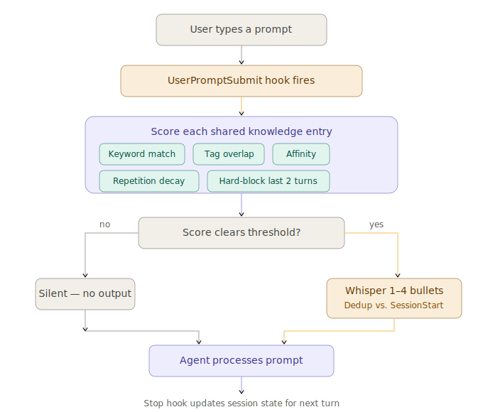

# Lore Design Overview

This document covers how Lore works under the hood — the architecture, memory model, ingestion pipeline, whisper system, promotion workflow, and storage layout. For usage and installation, see the [README](../README.md).

## Table of Contents

- [Architecture](#architecture)
- [Memory Tiers](#memory-tiers)
- [Delivery Layers](#delivery-layers)
- [LLM Ingestion Pipeline](#llm-ingestion-pipeline)
- [SessionStart Injection](#sessionstart-injection)
- [Whisper System](#whisper-system)
- [MCP Recall Tools](#mcp-recall-tools)
- [Promotion Workflow](#promotion-workflow)
- [Conflict Detection and Resolution](#conflict-detection-and-resolution)
- [Shared Knowledge Kinds](#shared-knowledge-kinds)
- [Validation](#validation)
- [Storage](#storage)
- [CLI](#cli)
- [Configuration Reference](#configuration-reference)

## Architecture

<p align="center">
  
</p>

Lore is structured as six layers with strict separation:

| Layer | Directory | Responsibility |
| --- | --- | --- |
| **Core library** | `src/core/`, `src/bridge/`, `src/shared/` | Reusable engine — memory store, shared store, hint engine, daemon, candidate extractor, types, validators. No plugin runtime assumptions. |
| **Plugin integration** | `src/plugin/` | SessionStart injection, capability-aware instruction template, pre-prompt whisper, stop observer, context building, whisper scoring. Plugin-facing only. |
| **Extraction** | `src/extraction/` | Provider interfaces and Codex implementations for async turn extraction and incremental consolidation. Pure provider boundary — no plugin runtime assumptions. |
| **Promotion** | `src/promotion/` | Promoter, policy, approval store, observation log, draft store, consolidator. |
| **MCP surface** | `src/mcp/` | Thin adapter exposing domain services as MCP recall tools via JSON-RPC 2.0 over stdio. |
| **Config** | `src/config.ts` | Single source for all paths, thresholds, scoring weights, and policy defaults. |

## Memory Tiers

Lore keeps two tiers of memory that serve different purposes:

### Project memory

Per-repo session context — active files, recent errors, tool usage. This is short-term working memory that stays local to each project. Managed by `FileMemoryStore`, which stores entries in per-project JSON files keyed by `sha256(projectId)`.

Project memory entries have three kinds:

| Kind | What it captures |
| --- | --- |
| `decision` | Architectural choices, naming conventions, user preferences |
| `working_context` | Active files, recent errors, inferred objectives |
| `reminder` | Follow-up tasks, known risks, unfinished threads |

The `CandidateExtractor` derives memory candidates from session events. For example, a `tool_run_failed` event produces both a `reminder` (risk/follow-up) and a `working_context` (working-set) candidate. Deduplication is by normalized content (trim, lowercase, collapse whitespace) within a project.

### Shared knowledge

Cross-project facts — domain rules, architecture decisions, coding preferences, glossary terms. This is long-term memory you build over time and that travels across all your projects. Managed by `FileSharedStore`.

Knowledge flows one direction: project memory can be **promoted** to shared knowledge (with your approval), but shared knowledge never flows back down into project memory.

## Delivery Layers

Shared knowledge reaches the Codex agent through three runtime delivery layers, each tuned for a different moment in the session lifecycle:

| Layer | Hook | When | What it delivers |
| --- | --- | --- | --- |
| **SessionStart** | `SessionStart` | Once, at session open | Top 10 stable facts scored across 5 dimensions and biased toward the current workspace. Wrapped in a capability-aware instruction template. Also runs the consolidation pass and renders a pending digest if suggestions exist. |
| **Whisper** | `UserPromptSubmit` | Before each prompt | 0-4 adaptive bullets. Shared knowledge first, plus light high-confidence session nudges when useful. Silent when nothing is relevant. |
| **MCP Recall** | On demand | When the agent calls a tool | Deep search across all shared knowledge via 4 MCP tools. |

A fourth internal component, the **hint engine** (`src/core/hint-engine.ts`), builds advisory bullets from project memories and shared knowledge. These hint bullets feed into the whisper system as secondary candidates — they are not a separate delivery surface.

### Hook lifecycle

Three Codex hooks drive the runtime:

1. **SessionStart** — fires once when a session opens. Runs the consolidation pass (bounded by a 3-second timeout), selects high-value shared knowledge entries, initializes whisper state with `injectedContentHashes` for downstream dedup, renders the instruction template, and appends a pending digest if there are pending suggestions.
2. **UserPromptSubmit** (sync, targets <200ms) — fires before each prompt. Scores shared entries and hint bullets against the current prompt, applies repetition decay, formats the `[Lore]` whisper block. Owns all whisper state writes.
3. **Stop** (async) — fires after each turn completes. Updates session context (turn index, recent files, recent tool names), calls the extraction provider to draft candidate shared knowledge from the completed turn, and writes draft candidates to the draft store. Does not write whisper decisions.

If `session_id` is missing from hook stdin, all whisper hooks no-op silently.

## LLM Ingestion Pipeline

Lore learns from your sessions through a two-stage pipeline: fast extraction per turn and incremental consolidation per session.

### Design principles

- **Human approval is the hard gate** — the pipeline can observe, cluster, draft, and rank, but shared knowledge only becomes active after explicit approval.
- **Fast path optimizes for signal capture** — the extraction stage prefers recall over precision. Missing a candidate is worse than a noisy draft.
- **Consolidation optimizes for quality** — the consolidation stage deduplicates, rewrites, and evidence-weights drafts so the pending queue stays clean.
- **Graceful degradation** — both stages are advisory. Extraction failures are silently swallowed; consolidation failures leave the pending queue untouched. Normal Codex flow is never blocked.

### Stage 1 — Turn extraction (Stop hook, async)

After each completed turn, the Stop hook builds a `TurnArtifact` from the hook input and calls the `ExtractionProvider`:

```typescript
type TurnArtifact = {
  sessionId: string;
  projectId: string;
  turnIndex: number;
  turnTimestamp: string;
  userPrompt: string;
  assistantResponse: string;
  toolSummaries: string[];
  files: string[];
  recentToolNames: string[];
};
```

The `CodexExtractionProvider` reads `~/.codex/auth.json` (API key) and `~/.codex/config.toml` (model) and calls the Codex Responses API with a structured prompt. The prompt requests candidates for `domain_rule`, `glossary_term`, `architecture_fact`, and `user_preference` only — `decision_record` is explicitly excluded because rationale reconstruction from a single turn is too lossy.

For `user_preference`, the extraction prompt gates extraction on explicitly stated preference language ("I always use X", "prefer X over Y") — implicit behavior patterns are left to the observation log, not the LLM extractor.

Auth warnings are rate-limited to once per 24 hours to avoid log spam when running with `auth_mode: "chatgpt"` or a missing API key. If auth config is missing or the API call fails, the Stop hook logs and returns normally — no draft is created for that turn, and the observation log path continues unaffected.

Extracted candidates are written as `DraftCandidate` objects to `~/.lore/drafts/<sessionId>.jsonl`:

```typescript
type DraftCandidate = {
  id: string;
  kind: SharedKnowledgeKind;
  title: string;
  content: string;
  confidence: number;
  evidenceNote: string;      // short LLM-generated rationale for this candidate
  sessionId: string;
  projectId: string;
  turnIndex: number;
  timestamp: string;
  tags: string[];
  signalStrength?: "strong" | "medium" | "weak";  // from signal classifier
};
```

### Signal Strength Classification

Before writing draft candidates, the extraction provider classifies the user prompt's tone using a pure regex classifier (`src/extraction/signal-classifier.ts`):

- **Strong signals** — imperatives ("always", "never", "must"), corrections ("wrong", "should be"), convention declarations ("the rule is", "our convention"). Confidence floor: 0.9.
- **Medium signals** — preferences ("I prefer", "let's use"), tendencies ("we tend to"). Confidence floor: 0.7.
- **Weak signals** — one-off choices, task-specific instructions, questions. Standard confidence.

Strong-signal drafts skip `minSessionCount` in the suggestion engine — a single "always use snake_case" is enough to create a pending entry. Dampener patterns ("just this once", "maybe", trailing "?") can downgrade signals.

### Stage 2 — Consolidation (SessionStart, bounded)

At session open, before building context, the consolidator runs with a timeout (`consolidationTimeoutMs`, default 3s). If it exceeds the budget, it skips and tries again next session. Stale pending data is preferred over a slow session open.

The `Consolidator` orchestrates:

1. **Read drafts** — `DraftStoreReader` loads all `DraftCandidate` records with `timestamp > lastConsolidatedAt` from all `drafts/*.jsonl` files. Malformed JSONL lines are skipped; one bad file does not block global consolidation.
2. **Aggregate observations** — `ObservationLogReader` loads matching observations to derive `sessionCount`, `projectCount`, and `lastSeenAt` per content hash. These frequency signals provide evidence strength the LLM cannot manufacture.
3. **Load existing pending** — the consolidator fetches all current pending entries regardless of `promotionSource`, including legacy `"suggested"` entries from the retired suggestion engine path.
4. **Semantic dedup pre-step** — before calling the provider, the consolidator runs write-time deduplication using Elasticsearch-style fingerprinting (tokenize, normalize IMPERATIVE/NEGATION/PREFERENCE synonyms, remove stopwords, sort, hash). Near-duplicates (Jaccard >= 0.85) are auto-filtered; candidate duplicates (>= 0.65) are forwarded to the provider as `candidatePairs` for LLM-assisted merging. See `src/shared/semantic-normalizer.ts`.
5. **Consolidate** — `ConsolidationProvider.consolidate()` groups draft candidates by semantic identity (`kind` + normalized content), rewrites into polished entries, updates evidence fields, and merges duplicates. The current `CodexConsolidationProvider` uses a deterministic grouping algorithm (grouping by `kind:normalizeContent(content)`); LLM-assisted rewriting is architected and gated pending prompt tuning.
6. **Reconcile pending** — for each consolidated result, the consolidator saves or updates the corresponding pending entry in the shared store.
7. **Merge deduplication** — when consolidation identifies that two pending entries represent the same rule, the survivor entry is updated and the consumed entries are hard-deleted from the pending queue via `deletePending()`. Each merge is recorded in the approval ledger: `{ action: "merge", survivorId, consumedIds[], actor: "system" }`.
8. **Conflict detection post-step** — after saving entries, the consolidator runs conflict detection against existing approved entries using a NegEx-adapted polarity detector with a 5-step decision tree. Conflicts are classified as `direct_negation`, `scope_mismatch`, `temporal_supersession`, `specialization`, or `ambiguous`. Detected conflicts (except specialization) are stored in `~/.lore/conflicts.json` and increment `contradictionCount` on affected entries. See `src/promotion/conflict-detector.ts`.
9. **Advance watermark** — only after the full pass succeeds, `lastConsolidatedAt` is updated in `~/.lore/consolidation-state.json`. If any step fails, the watermark does not advance and the same draft window is reprocessed next session. Reprocessing is safe because consolidation is idempotent — re-running against the same drafts updates evidence counters on already-merged entries without creating duplicates.

### Consolidation state

```typescript
type ConsolidationState = {
  lastConsolidatedAt: string;   // ISO timestamp of last successful run
  lastAttemptedAt: string;      // ISO timestamp of last attempt
  lastStatus: "success" | "failed" | "skipped";
  lastError?: string;           // error message if lastStatus is "failed"
};
```

### Evidence fields on pending entries

Pending entries produced by the consolidator carry three additional fields not present on explicitly promoted entries:

| Field | Type | Description |
| --- | --- | --- |
| `evidenceSummary` | `string` | One-sentence human-readable description of the evidence pattern |
| `sourceTurnCount` | `number` | Count of distinct `(sessionId, turnIndex)` pairs contributing evidence |
| `contradictionCount` | `number` | Count of observations/entries that contradict this entry's claim |
| `normalizedHash` | `string?` | Semantic fingerprint for Tier 2 dedup (tokenize → normalize → sort → hash) |

These fields are preserved after approval for provenance. Contradiction detection uses a NegEx-adapted polarity detector scoped to entries of the same `kind` with overlapping subject/scope tokens.

### Draftable kinds gate

The extraction and consolidation providers both respect the `eligibility` field of each kind's `PromotionCriteria`. Only `suggest_allowed` kinds enter the draft pipeline. `decision_record` has `eligibility: "explicit_only"` and is never drafted automatically — no new config or gate needed.

### Provider interfaces

Both stages sit behind thin interfaces, making them substitutable in tests without LLM calls:

```typescript
// src/extraction/extraction-provider.ts
type ExtractionProvider = {
  extractCandidates(turn: TurnArtifact): Promise<DraftCandidate[]>;
};

// src/extraction/consolidation-provider.ts
type ConsolidationProvider = {
  consolidate(input: ConsolidationInput): Promise<ConsolidationResult>;
};
```

Real implementations: `CodexExtractionProvider`, `CodexConsolidationProvider` (in `src/extraction/`). Test stubs inject no-op or fixture-returning implementations directly, keeping all extraction and consolidation tests deterministic and free of LLM calls.

## SessionStart Injection

### Scoring

The context builder (`src/plugin/context-builder.ts`) scores each approved shared knowledge entry across five weighted dimensions:

| Dimension | Weight | Computation |
| --- | --- | --- |
| **Confidence** | 0.25 | `entry.confidence` (0-1) |
| **Stability** | 0.20 | `0.5 * min(sessionCount/10, 1) + 0.5 * min(projectCount/3, 1)` |
| **Recency** | 0.10 | `1.0 - daysSince(lastSeenAt) / 90` (decays to 0 at 90 days) |
| **Kind priority** | 0.15 | Predefined: domain_rule (1.0), glossary_term (0.9), architecture_fact (0.8), user_preference (0.6), decision_record (0.5) |
| **Relevance** | 0.30 | `0.5 * projectMatch + 0.3 * tagOverlap + 0.2 * universalFlag` |

Relevance sub-scores:
- **projectMatch** — 1.0 if the current project is in `sourceProjectIds`, else 0.0
- **tagOverlap** — Jaccard similarity between current tags and entry tags
- **universalFlag** — 1.0 if entry has the `"universal"` tag or is a `domain_rule`

### Selection

1. **Hard gate** — confidence >= 0.7 and non-empty title/content
2. **Score** all passing entries
3. **Deduplicate** by `contentHash` (keep highest score)
4. **Sort** by score descending
5. **Select** greedily with per-kind caps and a total item limit (10) plus token budget (2000 tokens estimated as `ceil((title.length + content.length) / 4)`)
6. **Diversity pass** — fill remaining budget with underrepresented kinds

Per-kind caps: domain_rule (4), glossary_term (2), architecture_fact (3), user_preference (2), decision_record (1).

### Capability-aware template

The template module (`src/plugin/session-start-template.ts`) is a pure function with no I/O. It takes selected entries, a `LoreCapabilities` object, and an optional `pendingCount`, and returns a markdown instruction block — or `null` if no entries were selected.

```typescript
type LoreCapabilities = {
  recall: boolean;       // agent can call MCP recall tools
  promote: boolean;      // agent can promote knowledge inline
  demote: boolean;       // agent can demote knowledge inline
  cliAvailable: boolean; // CLI fallback text
};
```

Tool-specific instruction sections (recall guidance, promote/demote workflows, CLI fallback) are gated behind the corresponding capability flag. The agent never sees references to tools that are not available.

Template sections rendered in order:
1. Lore introduction (adapts delivery mode count to capabilities)
2. Usage guidance (cite naturally, stay silent if irrelevant)
3. Recall tools section (gated by `recall`)
4. Correction section (demote gated by `demote`, CLI fallback by `cliAvailable`)
5. Promotion section (gated by `promote`)
6. Conflict resolution (user instruction always wins)
7. Session knowledge entries (grouped by kind)
8. **Pending digest** — rendered only when `pendingCount > 0`: "Lore has N pending suggestions. → lore list-shared --status pending"
9. Whisper format reference
10. Behavior summary table (rows filtered by capabilities)
11. Configuration notes

Knowledge entries are grouped and ordered: Domain Rules, Architecture, Glossary, Preferences, Decisions.

## Whisper System

<p align="center">
  
</p>

The whisper system is Lore's key differentiator. It fires before every prompt via the `UserPromptSubmit` hook and adaptively injects relevant knowledge — or stays completely silent.

### How scoring works

For each shared knowledge entry, the whisper scorer (`src/plugin/whisper-scorer.ts`, a pure function with no I/O) computes a turn relevance score:

```
turnRelevance = 0.40 * keywordScore
              + 0.30 * tagScore
              + 0.20 * sessionAffinityScore
              + 0.10 * kindPriority
```

**Keyword score** — harmonic mean of recall (`matchingTokens / promptTokens`) and precision (`matchingTokens / entryTokens`). Tokens are lowercased, stripped of non-alphanumeric characters, and filtered through a 44-word stopword list. Minimum token length is configurable (default: 3 characters).

**Tag score** — Jaccard similarity between inferred prompt tags and entry tags. Prompt tags are inferred from three sources:
- File extensions in the prompt text and `recentFiles` (e.g., `.ts` maps to `typescript`, `.sql` to `database`)
- Tool/command names in the prompt text and `recentToolNames` (e.g., `npm`/`vitest` map to `testing`, `docker`/`kubectl` to `infrastructure`)
- Domain keywords in the prompt text (e.g., `billing`, `auth`, `migration`, `security`)

**Session affinity** — `0.5 * projectMatch + 0.5 * tagAffinity`, where `projectMatch` is 1.0 if the entry's source projects include the current project, and `tagAffinity` is the overlap between entry tags and tags inferred from recent files.

**Kind priority** — domain_rule (1.0), glossary_term (0.9), architecture_fact (0.8), user_preference (0.6), decision_record (0.5).

### Repetition control

To avoid nagging, the system applies two forms of decay:

- **Hard block** — entries whispered in the last 2 turns are completely suppressed (penalty = 1.0)
- **Recent whisper penalty** — decays by distance: turns <= 5 (0.4), turns <= 10 (0.15), turns > 10 (0.0)
- **Frequency penalty** — `min(0.3, whisperCount * 0.08)` for entries whispered many times

The effective score: `turnRelevance - recentWhisperPenalty - frequencyPenalty`

### Selection

Entries that clear the threshold (default: 0.35) are selected:

- Up to **2 shared knowledge bullets** (highest effective scores)
- Up to **2 hint bullets** from the hint engine, subject to strict gating:
  - Only `risk`, `next_step`, and `focus` categories (not `recall`)
  - Confidence >= 0.7
  - Further gated by session context strength — hints appear only when session context is strong (has recent files or tools) or when no shared bullets were selected and the prompt is not weak (has tags or > 4 tokens)
  - High-confidence hints (>= 0.9) get priority

### Deduplication

Entries already injected at SessionStart (tracked by `injectedContentHashes`) are excluded from whisper candidates. Within a single whisper payload, shared entries and hint bullets are also deduplicated against each other.

### Output format

When entries clear the threshold, the hook outputs:

```
[Lore]
- **rule**: DB columns use snake_case across all services.
- **architecture**: Postgres is the source of truth for billing state.
```

Labels are derived from kind: domain_rule maps to `rule`, architecture_fact to `architecture`, decision_record to `decision`, user_preference to `preference`, glossary_term to `term`.

When nothing is relevant, the hook outputs nothing — the agent doesn't even know Lore is there.

### Session state

Whisper state is per-session and tracked in `~/.lore/whisper-sessions/whisper-<sessionKey>.json`, where `sessionKey = sha256(session_id + ":" + cwd).slice(0, 12)`.

State contents:

| Field | Capacity | Description |
| --- | --- | --- |
| `turnIndex` | — | Current turn number, incremented by the Stop hook |
| `recentFiles` | 20 | Files seen in recent events |
| `recentToolNames` | 10 | Tools used in recent events |
| `whisperHistory` | 50 | Records of what was whispered (contentHash, kind, source, topReason, turnIndex, whisperCount) |
| `injectedContentHashes` | — | Content hashes from SessionStart injection, used for dedup |

The `UserPromptSubmit` hook owns all whisper decision writes. The `Stop` hook updates session context only (turn index, files, tools). This separation ensures dedup state survives crashes.

## MCP Recall Tools

Four tools are exposed via a JSON-RPC 2.0 stdio transport (`src/mcp/server.ts`, `src/mcp/stdio-transport.ts`). All return only `approved` entries.

| Tool | Filters | Description |
| --- | --- | --- |
| `lore.recall_rules` | `domain_rule` + `glossary_term` | Domain rules and vocabulary |
| `lore.recall_architecture` | `architecture_fact` | Architecture facts and platform assumptions |
| `lore.recall_decisions` | `decision_record` | Decision records with rationale |
| `lore.search_knowledge` | All kinds, freeform query | Cross-kind search with substring matching |

All tools accept an optional `limit` parameter (clamped to 1-25, default 10) and optional `tags` for filtering.

`lore.search_knowledge` ranks results by match quality: exact title match (100), title substring (80), tag match (60), content substring (40), with confidence as tiebreaker.

## Promotion Workflow

Lore never adds shared knowledge automatically. Every entry requires your explicit approval.

### State transitions

```
explicit promote  -->  [approved]  -->  demote   -->  [demoted]
draft+consolidate -->  [pending]   -->  approve  -->  [approved]  -->  demote  -->  [demoted]
                                   -->  reject   -->  [rejected]
```

No transitions from `rejected` or `demoted`. Re-promoting creates a new entry.

Pending entries are mutable while in `pending` state — the consolidator may improve title, content, evidence fields, and merge duplicates. Once an entry reaches `approved` or `rejected`, it is never touched by the consolidator.

### Paths to shared knowledge

- **Explicit promotion** — you promote knowledge manually via CLI (`lore promote`). Auto-approved with `confidence: 1.0`, skips pending state.
- **Draft + consolidate** — the Stop hook extracts candidate knowledge from completed turns asynchronously; SessionStart consolidation merges and rewrites those drafts into evidence-backed pending entries awaiting your approval.
- **Demotion** — soft-delete with full audit trail. Nothing is ever hard-deleted. The ledger preserves the complete history.

### Deduplication on promote

When promoting, the system checks for existing entries with the same `contentHash + kind`:
- If an **approved** entry exists: merges provenance (project IDs, memory IDs, tags) into the existing entry
- If a **pending** entry exists: upgrades it to approved
- If a **rejected** or **demoted** entry exists: creates a new entry (no resurrection)

### Ledger-first writes

All state-changing operations (promote, demote, approve, reject, merge) write to the approval ledger **before** updating the shared store. This enables crash recovery — if the process dies between the ledger write and the store update, reconciliation can replay the ledger to restore consistency. Reconciliation is idempotent and runs on first access.

The approval ledger supports five action types:

| Action | When | Metadata |
| --- | --- | --- |
| `promote` | Explicit CLI promote or initial consolidator write | — |
| `approve` | User approves a pending entry | optional reason |
| `reject` | User rejects a pending entry | reason |
| `demote` | User soft-deletes an approved entry | reason |
| `merge` | Consolidator merges duplicate pending entries | `survivorId`, `consumedIds[]` |
| `resolve` | User resolves a detected conflict between two entries | `resolution`, `supersededEntryId?`, `reason` |

### Consolidation-backed pending drafts

Pending entries are produced exclusively by the consolidator, which combines two signal sources:

- **Draft candidates** (`~/.lore/drafts/`) — LLM-extracted per-turn candidates from the Stop hook
- **Observation evidence** (`~/.lore/observations/`) — deterministic frequency signals (sessionCount, projectCount, lastSeenAt) written by the daemon

The observation log provides the cross-session evidence the LLM cannot manufacture. Together they produce evidence-backed pending entries with:
- `evidenceSummary` — one-sentence explanation of why this pattern was extracted
- `sourceTurnCount` — number of distinct turns that contributed evidence
- `contradictionCount` — count of contradicting observations (conservative; scoped by kind and overlapping tags)

Observation-based promotion policy thresholds (used by the consolidator when weighting candidates):

| Kind | Eligibility | Min Confidence | Min Sessions | Min Projects |
| --- | --- | --- | --- | --- |
| `domain_rule` | suggest_allowed | 0.90 | 3 | 1 |
| `glossary_term` | suggest_allowed | 0.85 | 2 | 1 |
| `architecture_fact` | suggest_allowed | 0.90 | 3 | 2 |
| `user_preference` | suggest_allowed | 0.92 | 5 | 2 |
| `decision_record` | explicit_only | 0.95 | 3 | 2 |

`decision_record` entries require explicit promotion and are never drafted automatically.

## Conflict Detection and Resolution

Lore detects contradictory knowledge entries and surfaces them for resolution.

### Detection

A pure conflict detector (`src/promotion/conflict-detector.ts`) runs as a post-step in the consolidator after saving new entries. It uses:

1. **NegEx-adapted polarity detection** — identifies whether an entry expresses a positive ("use X", "always X") or negative ("never X", "don't use X") stance
2. **Subject/scope extraction** — extracts the key topic tokens from entry content
3. **Token Jaccard similarity** — measures overlap between entry subjects (threshold: 0.3 for potential conflict)

### Five-step decision tree

For each pair of same-kind entries with overlapping subjects:

| Step | Check | Classification |
| --- | --- | --- |
| 1 | Same kind? | Skip if different kinds |
| 2 | Overlapping subjects? | Skip if Jaccard < 0.3 |
| 3 | Opposite polarity? | `direct_negation` if yes |
| 4 | Different scope? | `scope_mismatch` or `specialization` |
| 5 | Large temporal gap? | `temporal_supersession` if > 30 days |

`specialization` conflicts (a general rule + a specific override) are detected but not stored — they are valid.

### Resolution

Conflicts are stored in `~/.lore/conflicts.json` and surfaced at session start as a `[Lore · conflict detected]` block (at most one per session, priority-sorted: direct_negation > temporal > scope > ambiguous).

Four resolution actions via `lore resolve <idA> <idB>`:

| Action | Effect |
| --- | --- |
| `--keep <id>` | Keep winner, demote loser with `superseded:user_correction` |
| `--dismiss` | Mark as not-a-conflict, remove from conflict store |
| `--scope <id> --project <name>` | Narrow one entry's scope to a specific project |
| `--merge` | Combine both entries into one, demote the originals |

### Supersession chains

When a conflict is resolved by keeping one entry over another, the loser is linked via `supersededEntryId` in the ledger metadata. `lore history <id>` traces the chain of entries that superseded each other, showing the reason taxonomy: `superseded:user_correction`, `superseded:scope_narrowed`, `superseded:updated`, `superseded:merged`.

## Shared Knowledge Kinds

| Kind | What it captures | Example |
| --- | --- | --- |
| `domain_rule` | Stable rules that rarely change | "All DB columns use snake_case" |
| `architecture_fact` | Stack and platform assumptions | "PostgreSQL is source of truth" |
| `decision_record` | Past decisions with rationale | "Chose Postgres over Mongo for ACID" |
| `user_preference` | Coding style and tool choices | "Prefer named exports over default" |
| `glossary_term` | Domain vocabulary | "SOR: Source of Record" |

## Validation

Content is validated at system boundaries using multiple checks:

- **Title**: max 200 characters, no control characters
- **Content**: max 2000 characters, no control characters
- **Tags**: max 10 tags, each <= 50 characters
- **Content hash**: SHA-256 of normalized content (trimmed, lowercased, whitespace-collapsed)
- **forbidPatterns**: entries that match any of the following are rejected:
  - Absolute file paths (`/...`)
  - Common file extensions (`.ts`, `.js`, `.json`, `.yaml`)
  - Branch name prefixes (`main`, `master`, `dev`)

This keeps shared knowledge focused on stable, reusable facts rather than project-specific artifacts. Validation applies to both explicitly promoted entries and consolidator-produced candidates before they reach the pending queue.

## Storage

All data lives locally on your machine:

```
~/.lore/
  shared.json              Shared knowledge entries
  approval-ledger.json     Append-only audit trail (supports merge records)
  observations/            Per-session deterministic frequency evidence (JSONL)
  drafts/                  Per-session LLM-extracted draft candidates (JSONL)
  consolidation-state.json SessionStart consolidation watermark
  whisper-sessions/        Per-session whisper state
  conflicts.json           Detected knowledge conflicts (dedup/negation)
  projects/                Per-project memory files (keyed by sha256(projectId))
```

Both `observations/` and `drafts/` use per-session JSONL files (`<sessionId>.jsonl`). Concurrent sessions write to separate files with no contention. The consolidator reads across all files using a timestamp watermark to process only new records.

### Design principles

- **Ledger-first writes** — state changes write to the ledger before updating the shared store, enabling crash recovery via idempotent reconciliation.
- **Soft delete only** — `remove()` sets `approvalStatus: "demoted"`. The one exception is `deletePending()`, which hard-deletes entries the consolidator has merged into a survivor — these were never approved, so no audit trail entry is needed beyond the merge ledger record.
- **Per-session files** — concurrent sessions write to separate observation, draft, and whisper state files, avoiding contention.
- **Atomic writes** — all file writes use a temp file + rename pattern with exclusive lock files for concurrent access safety.
- **File locking** — exclusive lock files with retry (25ms delay, up to 80 attempts) prevent concurrent write corruption.
- **Watermark-based incremental processing** — the consolidator advances `lastConsolidatedAt` only after a full successful pass, ensuring idempotent retry on failure.

## CLI

The CLI (`src/cli.ts`) provides all management operations:

| Command | Description |
| --- | --- |
| `lore promote` | Promote knowledge explicitly (requires `--kind`, `--title`, `--content`) |
| `lore list-shared` | List shared knowledge entries (filter with `--kind`, `--status`) |
| `lore inspect <id>` | Show full entry details and approval ledger history |
| `lore demote <id>` | Soft-delete an entry (requires `--reason`) |
| `lore approve <id>` | Approve a pending suggestion |
| `lore reject <id>` | Reject a pending suggestion (requires `--reason`) |
| `lore import <file>` | Bulk import from convention files (`.cursorrules`, `CLAUDE.md`, `.clinerules`, `.windsurfrules`, `AGENTS.md`, `CONVENTIONS.md`) |
| `lore init` | Interactive onboarding — scan project for convention files and import |
| `lore dashboard` | Structured knowledge base overview with counts, tags, activity, and health |
| `lore resolve <idA> <idB>` | Resolve a conflict between two entries (`--keep`, `--dismiss`, `--scope`, `--merge`) |
| `lore history <id>` | Trace the supersession chain for an entry |
| `lore suggest` | Show observation log debug info (retired as pending-entry producer) |
| `lore demo` | Run a simulated session with sample events |
| `lore serve` | Read newline-delimited JSON events from stdin |
| `lore memories` | Print stored project memories |

All commands support `--json` for machine-readable output and `--shared-dir` to override the storage directory.

`lore list-shared` supports additional filters: `--tag <tag>`, `--stale` (entries not seen in 60+ days), `--contradictions` (entries with detected conflicts).

`lore import` supports: `--dry-run`, `--approve-all`, `--kind <kind>` (override inferred kind), `--tag-prefix <prefix>`.

`lore init` supports: `--yes` (auto-import all found files), `--approve-all`, `--project-dir <path>`.

## Configuration Reference

All defaults are defined in `src/config.ts` via `resolveConfig()`.

### SessionStart scoring weights

| Dimension | Weight |
| --- | --- |
| Confidence | 0.25 |
| Stability | 0.20 |
| Recency | 0.10 |
| Kind priority | 0.15 |
| Relevance | 0.30 |

### SessionStart limits

| Parameter | Default |
| --- | --- |
| Max items | 10 |
| Token budget | 2000 |
| Min confidence gate | 0.7 |

### Ingestion and consolidation

| Parameter | Default | Description |
| --- | --- | --- |
| `draftDir` | `~/.lore/drafts` | Directory for per-session draft candidate JSONL files |
| `consolidationStatePath` | `~/.lore/consolidation-state.json` | Consolidation watermark sidecar |
| `consolidationTimeoutMs` | 3000 | Max milliseconds SessionStart may spend on consolidation before skipping |

### Whisper tuning

| Parameter | Default | Description |
| --- | --- | --- |
| `whisperThreshold` | 0.35 | Minimum effective score for inclusion |
| `maxBullets` | 4 | Total cap per turn |
| `maxSharedBullets` | 2 | Max shared knowledge bullets |
| `maxHintBullets` | 2 | Max hint bullets |
| `hardBlockTurns` | 2 | Suppress entries whispered within this many turns |
| `hintConfidenceThreshold` | 0.7 | Minimum confidence for hint bullets |
| `keywordMinTokenLength` | 3 | Minimum characters for keyword tokens |
| `recentFilesCapacity` | 20 | Max recent files tracked in session state |
| `recentToolNamesCapacity` | 10 | Max recent tool names tracked |
| `whisperHistoryCapacity` | 50 | Max whisper history records |
